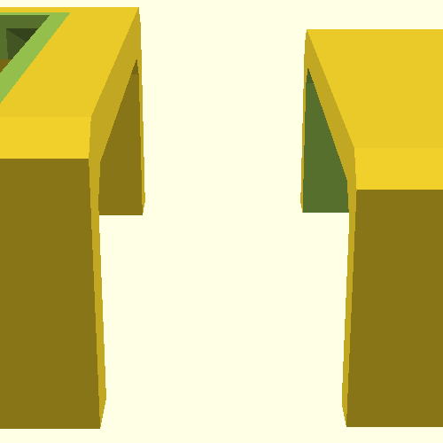
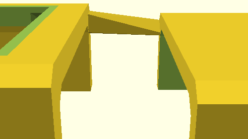
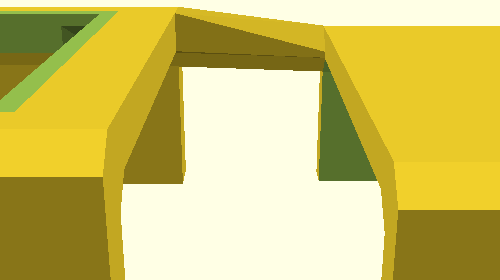
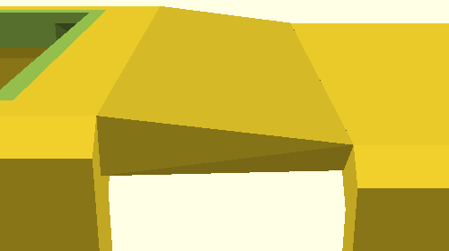
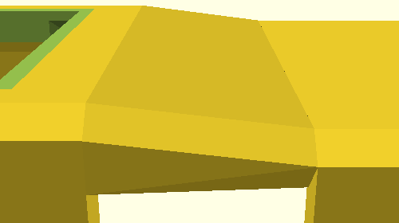
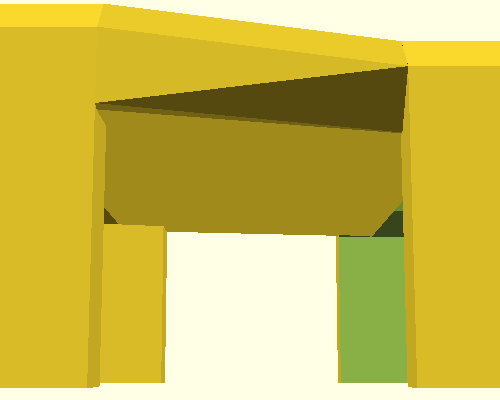
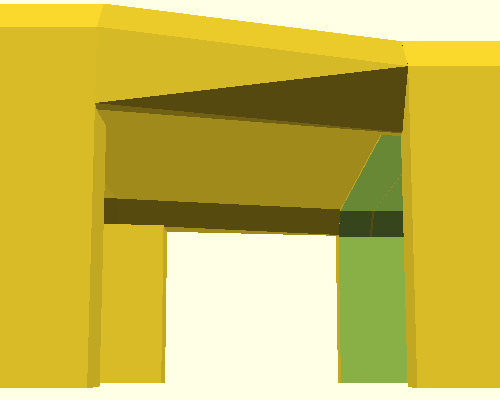
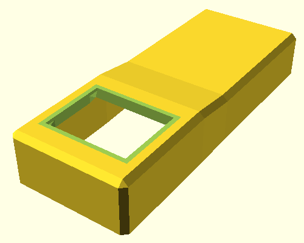
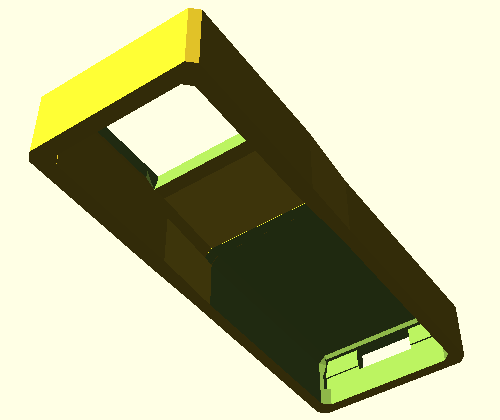

<!--This document was generated. Edit the source files under “resources/butty”, not this file.-->
# Tutorial: Butty the single-button keyboard (part 4)

This article continues from [part 3](tutorial-1c.md) and discusses
tweaks.



⤤ At the end of part 3, Butty was these two boxes that didn’t stick together.
This time around, we’re going to make them stick together.

## Naming our single key

Change `butty.yaml` to contain this:

```yaml
key-clusters:
  main:
    anchoring:
      extrinsic-offset: [0, 0, 10]
    aliases:
      k: [0, 0]
by-key:
  parameters:
    wall:
      extent: 1
      to-ground: true
  sides:
    NNE:
      parameters:
        wall:
          extent: 0
          to-ground: false
    NNW:
      parameters:
        wall:
          extent: 0
          to-ground: false
main-body:
  rear-housing:
    include: true
    anchoring:
      extrinsic-offset: [0, 32, 0]
    size: [22, 30, 9]
    thickness:
      walls: 1.5
      roof: 1.5
mcu:
  include: true
  anchoring:
    anchor: rear-housing-interior
    side: N
    segment: 1
    extrinsic-offset: [0, 0, -3]
```

That YAML is identical to what we had at the end of part 3, except for this bit
here:

```yaml
    aliases:
      k: [0, 0]
```

⤤ That bit does nothing for Butty’s appearance. Its only purpose is to give us
a name for Butty’s key. The name is `k`. We’re going to need it in a moment.

## Making the roof

Add the following to the bottom of `butty.yaml` and run the application as you
did in part 3.

```yaml
tweaks:
  top-bridge:
  - hull-around:
    - hull-around:
      - [k, WNW, 1]
      - [rear-housing-interior, WSW, 1]
      - [rear-housing-exterior, WSW, 1]
```

⤤ This is the start of one tweak. It, too, has a name, which is `top-bridge`.
That name is less important than `k`, but each tweak does need a name so that it
can be redefined or cancelled in another configuration file. Names also make
your configuration more readable to other people.

Here is Butty with the start of our tweak:



⤤ Butty now has one piece of a roof between the key mount and the rear housing.
This piece of roofing is the convex hull of three different “nodes”, each on
its own line in the YAML file:

* Segment 1 of the west-by-northwest corner of the key-mount wall. We
  encountered the same system of wall corners and segments when we made the
  rest of the key wall. Segment 1 is past the bevel, beyond the mounting plate.
  Tweaks allow you to connect such segments, and anything else, freely.
* Segment 1 of the west-by-southwest corner of the interior and exterior of the
  rear housing. These two nodes are also beneath a bevel and are therefore
  analogous to the first node, but on the rear housing.

Notice that the rear housing is targeted with two automatically reserved names.
One of these is rear-housing-interior, the same name we used to anchor the MCU.
By contrast, the node anchored to Butty’s key mount uses the name we just
defined: k. Keys do not have default names.

We won’t be getting very advanced in this tutorial, but you can read about the
syntax of tweaks in detail [here](options-main.md).

### Differences in size

There is a difference between the two kinds of features we’re tweaking. The
key-mount side on the left has more girth. Despite hitting only one segment,
the tweak there is as thick as the rest of the wall around Butty. By contrast,
the tweak is thinner at the rear housing side, on the right in the image. You
can see this more clearly by rotating the viewport in OpenSCAD.

The reason is that, by default, the nodes of a tweak derive their shape from
their anchor. You can override this behaviour with advanced syntax if you like,
but there is a reason for it. Tweaks have a common language for joining
parts of a keyboard, but by design, they do not hide fundamental differences at
the OpenSCAD interface.

The node that hits a corner of `k` uses the same type of voluminous cuboid as
the wall around the key cluster to blend into that wall. The precise location
of that node is the centre of the cuboid in OpenSCAD.

In the OpenSCAD code generated by the DMOTE application, the rear housing’s
exterior and interior are not cuboids but a couple of irregular polyhedra.
Their smallest unit of composition has no volume. The tweak nodes we have
specified for the rear housing hit such points directly, hence their smaller
size.

### More nodes

Expand the tweaks section in butty.yaml.

```yaml
tweaks:
  top-bridge:
  - hull-around:
    - hull-around:
      - [k, WNW, 1]
      - [rear-housing-interior, WSW, 1]
      - [rear-housing-exterior, WSW, 1]
    - hull-around:
      - [k, WNW]
      - [rear-housing-interior, WSW, 0]
      - [rear-housing-exterior, WSW, 0]
```



The `top-bridge` tweak as a whole is now the convex hull of six nodes, in two
groups. The groups serve no purpose yet, but will soon. Notice that segment 0
is the default for nodes anchored to key mounts and is therefore omitted for
`k`, but it’s not the default for rear housing nodes: Another difference
between the types of features you can tweak.

The next step is another one of those groups, mirroring the second group but
moving to the east side of Butty:

```yaml
tweaks:
  top-bridge:
  - hull-around:
    - hull-around:
      - [k, WNW, 1]
      - [rear-housing-interior, WSW, 1]
      - [rear-housing-exterior, WSW, 1]
    - hull-around:
      - [k, WNW]
      - [rear-housing-interior, WSW, 0]
      - [rear-housing-exterior, WSW, 0]
    - hull-around:
      - [k, ENE]
      - [rear-housing-interior, ESE, 0]
      - [rear-housing-exterior, ESE, 0]
```



Another group, another piece of the roof, and we’ll continue in the same style.

```yaml
tweaks:
  top-bridge:
  - hull-around:
    - hull-around:
      - [k, WNW, 1]
      - [rear-housing-interior, WSW, 1]
      - [rear-housing-exterior, WSW, 1]
    - hull-around:
      - [k, WNW]
      - [rear-housing-interior, WSW, 0]
      - [rear-housing-exterior, WSW, 0]
    - hull-around:
      - [k, ENE]
      - [rear-housing-interior, ESE, 0]
      - [rear-housing-exterior, ESE, 0]
    - hull-around:
      - [k, ENE, 1]
      - [rear-housing-interior, ESE, 1]
      - [rear-housing-exterior, ESE, 1]
```



⤤ That looks like a finished roof, but it’s not.

⤥ Check out the view from below.



Because we have expanded a single convex hull all the way across Butty’s top
(around all of our four groups), the same shape also intrudes on Butty’s
inside. That is not a fatal problem, but printing that extra plastic would
serve no purpose. Let’s get rid of it by altering the properties of the
outermost hull in our tweak, without altering the subordinate nodes. Add a
setting for `chunk-size`:

```yaml
tweaks:
  top-bridge:
  - chunk-size: 2
    hull-around:
    - hull-around:
      - [k, WNW, 1]
      - [rear-housing-interior, WSW, 1]
      - [rear-housing-exterior, WSW, 1]
    - hull-around:
      - [k, WNW]
      - [rear-housing-interior, WSW, 0]
      - [rear-housing-exterior, WSW, 0]
    - hull-around:
      - [k, ENE]
      - [rear-housing-interior, ESE, 0]
      - [rear-housing-exterior, ESE, 0]
    - hull-around:
      - [k, ENE, 1]
      - [rear-housing-interior, ESE, 1]
      - [rear-housing-exterior, ESE, 1]
```



There is still a convex hull around each of the three items in each of the four
groups, but there is no longer a convex hull around the four groups as a unit.
Instead, each set of 2 neighbouring groups (chunk size 2) forms a convex hull,
overlapping to make the roof, but not so far as to close the interior. In
particular, the first and last groups no longer meet.

## Walls

To round out this tutorial, we’re going to add another tweak in one go. It uses
the same anchors as the edges of the roof, but this one goes to ground like
the walls around the key mounting plate. Add this to the bottom of `butty.yaml`:

```yaml
  wall-bridges:
  - at-ground: true
    hull-around:
    - [k, WNW, 1]
    - [rear-housing-exterior, WSW, 1]
    - [rear-housing-interior, WSW, 1]
  - at-ground: true
    hull-around:
    - [k, ENE, 1]
    - [rear-housing-exterior, ESE, 1]
    - [rear-housing-interior, ESE, 1]
```

Notice that this new tweak has two nodes at the top level, right under the
name. These are not hulled with one another.




It looks neat enough from the outside, and the inside of Butty is still hollow,
so we’re good.

## Summary

In this tutorial, we have learned:

* How to name a key for use as an anchor of tweaks.
* How to use tweaks with `hull-around`, `chunk-size` and `at-ground`.
* That nodes of a tweak behave differently, depending on
  the type of their anchor.

In the last part of this tutorial, [part 5](tutorial-1e.md), we’re going to
add a bottom plate.
